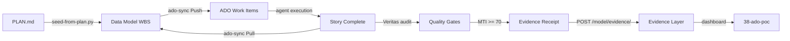

# STATUS.md - Project 53: EVA Refactor Factory

**Last Updated**: March 2, 2026 2:30 PM ET  
**Session**: 19  
**Phase**: Inception  
**Current Sprint**: Pre-Sprint (Planning)  
**Active Agent**: @agent:github-copilot

---

## Project Metadata

```yaml
project_id: 53-refactor
project_name: EVA Refactor Factory
maturity: idea
phase: inception
sprint_current: null
sprint_total: 20
weeks_elapsed: 0
weeks_remaining: 23
```

---

## Current State

### Phase Progress

| Phase | Sprints | Status | Start Date | End Date | Completion |
|---|---|---|---|---|---|
| **Phase 0: Bootstrap** | Pre | 🔄 IN PROGRESS | 2026-03-02 | TBD | 20% |
| Phase 1: Discovery | S01-S02 | ⏳ PLANNED | TBD | TBD | 0% |
| Phase 2: Planning | S03-S04 | ⏳ PLANNED | TBD | TBD | 0% |
| Phase 3: Execution | S05-S22 | ⏳ PLANNED | TBD | TBD | 0% |
| Phase 4: Validation | S23 | ⏳ PLANNED | TBD | TBD | 0% |

### Sprint Tracking

**Current Sprint**: Pre-Sprint (Bootstrap)  
**Sprint Goal**: Initialize project infrastructure, governance documents, data model integration  
**Sprint Start**: March 2, 2026  
**Sprint End**: TBD  
**Sprint Status**: 🔄 IN PROGRESS

**Stories**:
- [x] [REFACTOR-00-001] Create project governance documents (20% - README.md complete, PLAN/STATUS/ACCEPTANCE in progress)
- [ ] [REFACTOR-00-002] Create discovery agent (0% - not started)
- [ ] [REFACTOR-00-003] Create planning agent (0% - not started)
- [ ] [REFACTOR-00-004] Create execution agent (0% - not started)
- [ ] [REFACTOR-00-005] Create validation agent (0% - not started)
- [ ] [REFACTOR-00-006] Create refactor workflow (0% - not started)
- [ ] [REFACTOR-00-007] Extend data model with refactor layers (0% - not started)

**Progress**: 1/7 stories started (14%), 0/7 complete (0%)

---

## Quality Metrics

### MTI (Model Trust Index)

| System | Current Score | Target Score | Gap | Status |
|---|---|---|---|---|
| **EVA-JP-v1.2 (Baseline)** | TBD | >= 50 | TBD | ⏳ NOT MEASURED |
| **53-refactor (Output)** | N/A | >= 80 | N/A | ⏳ NOT STARTED |

**Notes**:
- EVA-JP-v1.2 baseline MTI will be established in Phase 1 (Discovery, Sprint 1, Story REFACTOR-01-005)
- Target improvement: 50 → 80 (60% increase)
- MTI components (v5): Field Population + Artifact Presence + Veritas Trust + Integration Coverage + Evidence Layer Integration

### Test Coverage

| System | Current Coverage | Target Coverage | Gap | Status |
|---|---|---|---|---|
| **EVA-JP-v1.2 (Baseline)** | ~40% | N/A | N/A | ⏳ Estimated |
| **53-refactor (Output)** | N/A | >= 80% | N/A | ⏳ NOT STARTED |

**Notes**:
- EVA-JP-v1.2 test coverage will be measured in Phase 1 (Discovery, Sprint 1)
- Target: 80% coverage for all refactored modules (unit + integration + E2E)

### Story Tracking

| Category | Planned | In Progress | Completed | Blocked | Total |
|---|---|---|---|---|---|
| **Phase 0: Bootstrap** | 6 | 1 | 0 | 0 | 7 |
| **Phase 1: Discovery** | 8 | 0 | 0 | 0 | 8 |
| **Phase 2: Planning** | 8 | 0 | 0 | 0 | 8 |
| **Phase 3: Execution** | TBD | 0 | 0 | 0 | ~400+ |
| **Phase 4: Validation** | 6 | 0 | 0 | 0 | 6 |
| **Total** | 28+ | 1 | 0 | 0 | ~429+ |

**Notes**:
- Phase 3 (Execution) stories will be generated by AI in Phase 2 (Planning, Sprint 4, Story REFACTOR-02-005 through REFACTOR-02-010)
- Target: 500+ total stories across all phases

---

## Evidence Layer Integration

**Evidence Collection Status**: ⏳ NOT STARTED

| Metric | Value | Target | Notes |
|---|---|---|---|
| **Evidence Receipts** | 0 | 500+ | One per story completion |
| **DPDCA Phases Tracked** | 0 | 5 | Discover, Plan, Do, Check, Act |
| **Correlation IDs** | 0 | 20+ | One per sprint |
| **Validation Pass Rate** | N/A | 100% | Quality gates enforced |

**Integration**:
- Every story completion → POST `/model/evidence/` with artifacts, validation, commits, timeline
- Query evidence: `GET /model/evidence/?project_id=53-refactor&sprint_id=REFACTOR-S05`
- Immutable audit trail for entire refactor (March 2026 - August 2026)

---

## Data Model Integration

### WBS Layer Population

**Status**: ⏳ NOT STARTED (waiting for seed-from-plan.py execution)

| Field | Current Count | Target Count | Population Rate | Status |
|---|---|---|---|---|
| **Stories Total** | 0 | 500+ | 0% | ⏳ NOT SEEDED |
| **With Sprint** | 0 | 475+ (95%) | 0% | ⏳ NOT SEEDED |
| **With Assignee** | 0 | 450+ (90%) | 0% | ⏳ NOT SEEDED |
| **With ADO ID** | 0 | 475+ (95%) | 0% | ⏳ NOT SEEDED |
| **Status: Done** | 0 | 0 (0%) | N/A | ⏳ NOT STARTED |

**Notes**:
- PLAN.md created (March 2, 2026 2:30 PM ET) with initial 29 stories (Phase 0-2)
- Phase 3 (Execution) stories will be AI-generated in Sprint 4, expanding WBS to 500+ stories
- seed-from-plan.py will run after Phase 2 Planning completes

### New Data Model Layers (L33, L34)

**Status**: ⏳ NOT CREATED

| Layer | Purpose | Schema Defined | Implemented | Records |
|---|---|---|---|---|
| **L33: migrations** | Source → target file mappings | ⏳ NO | ⏳ NO | 0 |
| **L34: refactor_decisions** | Architecture decision records (ADRs) | ⏳ NO | ⏳ NO | 0 |

**Story**: [REFACTOR-00-007] Extend data model with refactor layers (planned)

---

## Veritas-Model-ADO Workflow Status

### Enhancements Active

| Enhancement | Status | Impact on 53-refactor |
|---|---|---|
| **Enhancement 2: seed-from-plan.py** | ✅ ACTIVE | Will seed 500+ stories automatically with sprint/assignee/blockers from PLAN.md |
| **Enhancement 3: Veritas Quality Gates** | ✅ ACTIVE | Will enforce MTI >= 70 + field population before marking stories done |
| **Enhancement 1: ADO Bidirectional Sync** | ✅ ACTIVE | Will keep WBS and ADO in sync during 20-sprint execution (Pull + Push modes) |

### Workflow Integration



---

## Azure Resources

### Target Deployment (Post-Refactor)

**Status**: ⏳ NOT CREATED (waiting for Terraform IaC in Phase 3)

| Resource Type | Name | SKU | Location | Status |
|---|---|---|---|---|
| **Postgres Flexible Server** | eva-refactor-db | B_Standard_B1ms | Canada Central | ⏳ NOT CREATED |
| **Redis Cache** | eva-refactor-cache | Basic C1 | Canada Central | ⏳ NOT CREATED |
| **Container App** | eva-refactor-backend | 0.5 CPU, 1GB | Canada Central | ⏳ NOT CREATED |
| **Static Web App** | eva-refactor-frontend | Free | Canada Central | ⏳ NOT CREATED |
| **Key Vault** | eva-refactor-kv | Standard | Canada Central | ⏳ NOT CREATED |
| **Application Insights** | eva-refactor-ai | Standard | Canada Central | ⏳ NOT CREATED |

**Estimated Monthly Cost**: $120/month (vs EVA-JP-v1.2: $200/month Cosmos-heavy → 40% reduction)

### Legacy System (EVA-JP-v1.2)

**Status**: ✅ ACTIVE (production)

| Resource Type | Name | Status | Notes |
|---|---|---|---|
| **App Service** | eva-jp-backend | ✅ RUNNING | FastAPI app.py (2473 lines) |
| **Static Web App** | eva-jp-frontend | ✅ RUNNING | React 18 + Vite |
| **Cosmos DB** | eva-jp-cosmos | ✅ RUNNING | ~$80/month RU/s |
| **Blob Storage** | evajpstorage | ✅ RUNNING | Document uploads |
| **Functions** | eva-jp-functions | ✅ RUNNING | Enrichment pipeline |
| **Azure AI Search** | eva-jp-search | ✅ RUNNING | RAG retrieval |
| **Azure OpenAI** | eva-jp-openai | ✅ RUNNING | GPT-4 chat |

**Location**: C:\AICOE\EVA-JP-v1.2  
**Branch**: main  
**Last Commit**: TBD  
**Production URL**: TBD

---

## Blockers

### Current Blockers

**None** (Phase 0 Bootstrap has no dependencies)

### Anticipated Blockers (Future Phases)

| Blocker | Phase | Impact | Mitigation Strategy |
|---|---|---|---|
| **Cosmos→Postgres data incompatibility** | Phase 3 (Sprint 19) | High | Dual-write validation for 2 weeks, data reconciliation scripts |
| **Feature parity gaps discovered late** | Phase 4 (Sprint 23) | Critical | Feature parity tests every sprint, parallel deployment |
| **Agent hallucinations in code generation** | Phase 3 (Sprint 5-22) | Medium | Human-in-the-loop PR review, Veritas quality gates |
| **Azure quota limits (Postgres vCores)** | Phase 3 (Sprint 20) | Medium | Request quota increase proactively, use lower SKU for dev |

---

## Key Decisions

### Technology Stack (Approved March 2, 2026)

| Component | Old (EVA-JP-v1.2) | New (53-refactor) | Decision Record |
|---|---|---|---|
| **Frontend Framework** | React 18 | React 19 | REFACTOR-D001 (to be created) |
| **UI Library** | Fluent UI v8/v9 hybrid | Fluent UI v9 + Spark | REFACTOR-D001 |
| **Backend Framework** | FastAPI (monolith) | FastAPI (modular) + Agent Framework | REFACTOR-D002 (to be created) |
| **Database** | Cosmos DB | Postgres Flexible Server | REFACTOR-D003 (to be created) |
| **Caching** | None | Redis Cache | REFACTOR-D003 |
| **IaC** | Bicep | Terraform | REFACTOR-D004 (to be created) |
| **Observability** | Application Insights (basic) | OpenTelemetry + App Insights | TBD |
| **Testing** | pytest (40% coverage) | pytest + Playwright (80% coverage) | TBD |

**Decision Log**: `docs/architecture-decisions/` (to be created in Phase 2)

### Migration Strategy (Approved March 2, 2026)

**Selected**: **Hybrid** (4 months, medium risk)

**Rationale**:
- Keep frontend React 18 (minor upgrade to 19, low risk)
- Refactor backend completely (decompose app.py → routers, integrate Agent Framework)
- Dual-write data migration (Cosmos + Postgres in parallel, gradual cutover)
- 60% cost savings (Postgres + Redis cheaper than Cosmos)
- Balance risk vs speed (faster than incremental, safer than greenfield)

**Alternatives Rejected**:
- ❌ Incremental Refactor (6 months, low risk): Too slow, high coordination overhead
- ❌ Greenfield Rewrite (3 months, high risk): Feature parity gaps likely, risky cutover

---

## Timeline

### Overall Timeline (23 weeks)

**Start Date**: March 2, 2026 (Week 0 - Bootstrap)  
**Target Completion**: August 2026 (Week 23 - Validation)  
**Status**: 🔄 IN PROGRESS (0% complete)

| Phase | Weeks | Sprints | Start | End | Status |
|---|---|---|---|---|---|
| **Phase 0: Bootstrap** | 1 | Pre | 2026-03-02 | TBD | 🔄 IN PROGRESS (20%) |
| **Phase 1: Discovery** | 2 | S01-S02 | TBD | TBD | ⏳ PLANNED |
| **Phase 2: Planning** | 2 | S03-S04 | TBD | TBD | ⏳ PLANNED |
| **Phase 3: Execution** | 18 | S05-S22 | TBD | TBD | ⏳ PLANNED |
| **Phase 4: Validation** | 1 | S23 | TBD | TBD | ⏳ PLANNED |

### Sprint Calendar (Planned)

| Sprint | Week | Phase | Goal | Stories | Status |
|---|---|---|---|---|---|
| **Pre** | 0 | Bootstrap | Initialize project | 7 | 🔄 IN PROGRESS |
| **S01** | 1 | Discovery | Scan EVA-JP-v1.2 backend | 5 | ⏳ PLANNED |
| **S02** | 2 | Discovery | Scan EVA-JP-v1.2 frontend | 3 | ⏳ PLANNED |
| **S03** | 3 | Planning | Analyze migration options | 4 | ⏳ PLANNED |
| **S04** | 4 | Planning | Generate 500+ story WBS | 4 | ⏳ PLANNED |
| **S05-S14** | 5-14 | Execution | Backend decomposition | 100 | ⏳ PLANNED |
| **S15-S18** | 15-18 | Execution | Frontend modularization | 80 | ⏳ PLANNED |
| **S19-S20** | 19-20 | Execution | Data migration | 60 | ⏳ PLANNED |
| **S21-S22** | 21-22 | Execution | Testing & validation | 120 | ⏳ PLANNED |
| **S23** | 23 | Validation | Final validation & cutover | 6 | ⏳ PLANNED |

---

## Session Notes

### Session 19 (March 2, 2026 12:30 PM - 2:30 PM ET)

**Participants**: @agent:github-copilot, @user:marco.presta

**Summary**:
- **12:30 PM**: Session start - Cosmos DB incident resolved, Veritas-Model-ADO workflow enhancements complete (Enhancement 1-3)
- **2:20 PM**: User introduced Project 53-refactor concept: autonomous refactoring factory for EVA-JP-v1.2
- **2:20-2:30 PM**: Created project structure, README.md (450 lines), PLAN.md (initial WBS with 29 stories), STATUS.md (this file)

**Accomplishments**:
- ✅ Created C:\AICOE\eva-foundry\53-refactor\ directory structure (.github/workflows/, agents/, scripts/, docs/)
- ✅ Created README.md with vision, architecture, 4 agents, GitHub Actions workflow, success criteria, technology recommendations
- ✅ Created PLAN.md with Phases 0-4 breakdown, 29 initial stories (bootstrap, discovery, planning), story templates for execution
- ✅ Analyzed EVA-JP-v1.2 structure: React 18 + FastAPI + Cosmos, monolithic app.py (2473 lines), ~40% test coverage
- ✅ Designed migration strategy: Hybrid (4 months) - React 18→19, FastAPI modular + Agent Framework, Cosmos→Postgres+Redis (60% cost reduction)

**Decisions Made**:
- Technology Stack: React 19 + Fluent UI v9 + FastAPI + Agent Framework + Postgres + Redis + Terraform
- Migration Strategy: Hybrid (balance risk vs speed, dual-write data migration)
- Architecture: 4 agents (Discovery, Planning, Execution, Validation) + GitHub Actions workflow (discover → plan → execute → validate)
- Success Criteria: 4 phases, 20 sprints, MTI 50→80 (60% improvement), test coverage 40%→80%, cost -40%

**Next Steps**:
1. Complete ACCEPTANCE.md with phase-based success criteria
2. Initialize git repository (git init, commit, push to https://github.com/eva-foundry/53-refactor)
3. Implement as-is-scanner.js (scan EVA-JP-v1.2 → populate data model)
4. Implement migration-planner.py (AI generates 500+ stories)
5. Run Phase 1 Discovery (Veritas audit + as-is scanner)

**Issues/Risks**:
- None yet (Phase 0 Bootstrap has no blockers)

**Notes**:
- Project 53-refactor builds on completed Veritas-Model-ADO workflow enhancements:
  - Enhancement 2 (seed-from-plan.py): Will seed 500+ stories automatically
  - Enhancement 3 (Veritas quality gates): Will enforce MTI >= 70 + field population
  - Enhancement 1 (ADO bidirectional sync): Will keep WBS and ADO in sync during 20 sprints
- First real-world test of full DPDCA automation workflow at scale

---

## Next Actions (Immediate)

**Priority 1 (Next 30 min)**:
- [ ] Complete ACCEPTANCE.md with phase-based success criteria (checkboxes for Discovery, Planning, Execution, Validation)
- [ ] Initialize git repository and push to https://github.com/eva-foundry/53-refactor

**Priority 2 (Next 2 hours)**:
- [ ] Implement scripts/as-is-scanner.js (scan EVA-JP-v1.2 → populate data model with services, endpoints, screens, containers)
- [ ] Implement scripts/migration-planner.py (AI generates 500+ story WBS using Agent Framework)

**Priority 3 (Next 1 day)**:
- [ ] Implement scripts/gen-sprint-manifest.py (generate sprint execution plan for GitHub Actions matrix)
- [ ] Implement agents/ (discovery-agent.yml, planning-agent.yml, execution-agent.yml, validation-agent.yml)

**Priority 4 (Next 2 days)**:
- [ ] Create .github/workflows/refactor-workflow.yml (discover → plan → execute → validate jobs)
- [ ] Run Phase 1 Discovery: Veritas audit on EVA-JP-v1.2 + as-is-scanner.js execution

---

## Project Health Dashboard

| Category | Status | Notes |
|---|---|---|
| **Overall Health** | 🟢 HEALTHY | Phase 0 Bootstrap on track |
| **Schedule** | 🟢 ON TRACK | Week 0 of 23, no delays |
| **Budget** | 🟢 ON BUDGET | No Azure resources created yet |
| **Quality** | 🟡 NOT MEASURED | MTI baseline TBD (Phase 1) |
| **Risks** | 🟢 LOW | No blockers, Phase 0 has no dependencies |
| **Team Morale** | 🟢 HIGH | Autonomous agents ready |

---

**END OF STATUS.md v1.0.0**

**Next Update**: After Phase 0 Bootstrap completes (when git repository initialized + ACCEPTANCE.md created)
